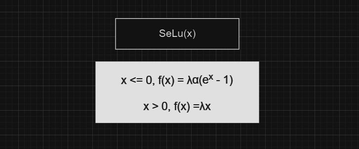
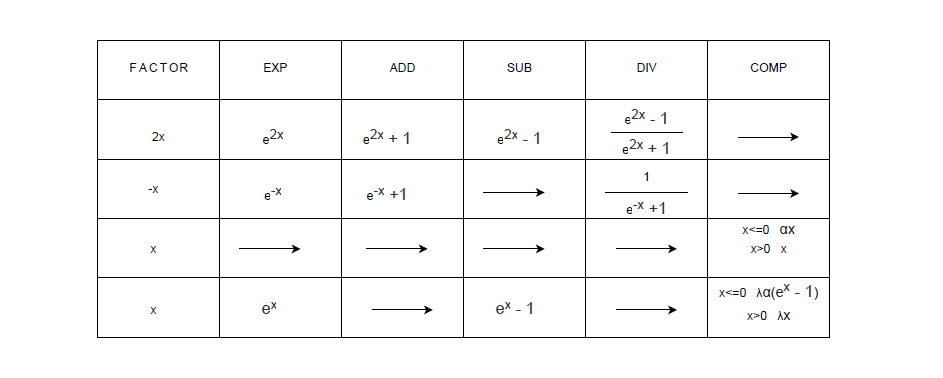
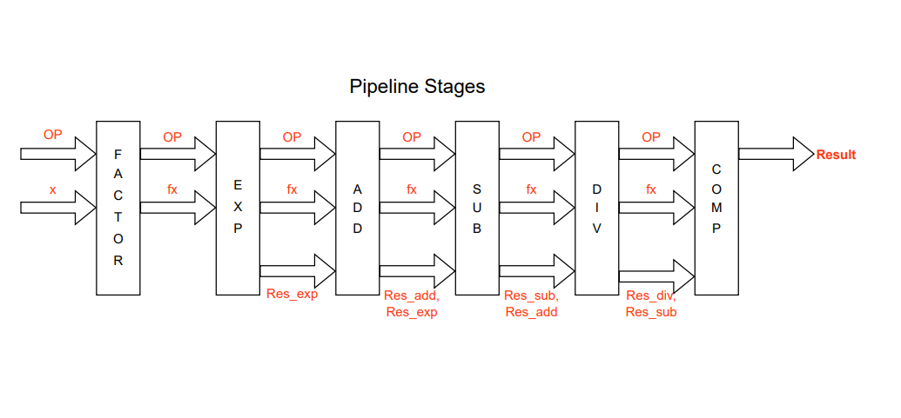

## Pipelined-Module
### Aim of the project: 
#### To design an area-efficient pipelined module to support unary operators ( activation functions used in deep learning ) :
The activation functions are simple mathematical functions that convert a given input into a desired output within a specific range. In this project, we used : tanh(x), sigmoid(x), leaky_ReLu(x), SeLu(x).
These functions are evaluated using several pipelining stages, each stage supports a unary operation like addition, subtraction, division, etc.
#### 1) tanh(x) 
> tanh(x) uses exponential, addition, subtraction, and division operations. In the first expression, we will have to calculate e^x and  e^x separately, but when we simplify it to the second expression we will just use the exponential stage once e^2x. In this case, I need one more stage to factor x to 2x.
> 
.png)

#### 2) sigmoid(x)
> sigmoid (x) uses exponential, addition, and division operations. It also uses a stage to factor x to -x. 
>
.png)

#### 3) leaky_ReLu(x) 
> LReLu(x) uses a stage to compare value of x with 0. Here α is the learning rate, and after referring to sources from the internet we took its value as 1.67.
>

#### 4) SeLu(x)
> Just like LReLu(x), SeLu(x) also uses a stage to compare value of x with 0. Here λ is the scale, and its value is taken as 1.05.
> 

### Pipeline stages  
>  
After simplifying the expressions of the activation functions such that we use a minimum number of pipeline stages, we got **6** stages. We made the order of the stages such that we can reuse the previous stages' output as input for the upcoming stages. For example, in the tanh(x) function value of e^2x which is evaluated in the second stage is given as inputs to the addition and subtraction stages.
>   

>
As shown in the above table, some functions don't use several stages. The data from the previous stage just passes through such stages without any change. For example, in the *LReLu* function the input just passes through the first five stages and only the comparison stage is used.
>
### Design 
>
The figure shown below is the overall pipelined module.
>

>
*x* represents the given input. Here OP represents the function (which is also given as an input along with x), which enables the pipeline stages based on the function used. *Res_exp*, *Res_add*, *Res_sub*,*Res_div* are the results of the exponential, addition, subtraction and division stages respectively.
>

## TO RUN 
use the comand make
