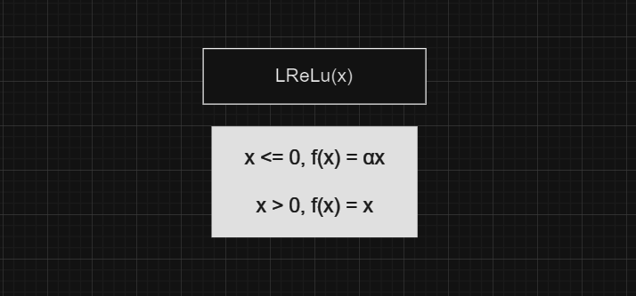

## Pipelined-Module
### Aim of the project: 
#### To design an area-efficient pipelined module to support unary operators ( activation functions used in deep learning )
The activation functions are simple mathematical functions that convert a given input into a desired output within a specific range. In this project, we used : tanh(x), sigmoid(x), leaky_ReLu(x), SeLu(x).
These functions are evaluated using several pipelining stages, each stage supports a unary operation like addition, subtraction, division, etc.
#### 1) tanh(x) 
> tanh(x) uses exponential, addition, subtraction, and division operations. In the first expression, we will have to calculate $e^x$ and  $e^x$ separately, but when we simplify it to the second expression we will just use the exponential stage once $e^(2x)$. In this case, I need one more stage to factor x to 2x.
> 
.png)

#### 2) sigmoid(x)
> sigmoid (x) uses exponential, addition, and division operations. It also uses a stage to factor x to -x. 
>
.png)

#### 3) leaky_ReLu(x) 
> LReLu(x) uses a stage to compare value of x with 0. Here α is the learning rate, and after referring to sources from the internet we took its value as 1.67.
>

#### 4) SeLu(x)
> Just like LReLu(x), SeLu(x) also uses a stage to compare value of x with 0. Here λ is the scale, and its value is taken as 1.05.
> 

### Pipeline stages  
>  
After simplifying the expressions of the activation functions such that we use a minimum number of pipeline stages, we got **6** stages. The stages are Factor, Exponential, Addition, Subtraction, Division and Comparison. We made the order of the stages such that we can reuse the previous stages' output as input for the upcoming stages. For example, in the tanh(x) function value of $e^2x$ which is evaluated in the second stage is given as inputs to the addition and subtraction stages.
>   

>
As shown in the above table, some functions don't use several stages. The data from the previous stage just passes through such stages without any change. For example, in the *LReLu* function the input just passes through the first five stages and only the comparison stage is used.
>
### Design 
>
The figure shown below is the overall pipelined module.
>

>
*x* represents the given input. Here OP represents the function (which is also given as an input along with x), which enables the pipeline stages based on the function used. *Res_exp*, *Res_add*, *Res_sub*, *Res_div* are the results of the exponential, addition, subtraction and division stages respectively.
   * 00: tanh(x)
   * 01: sigmoid(x)
   * 10: LReLu(x)
   * 11: SeLu(x)
>
### Implementation of the pipeline stages using Bluespec 
Each of the six stages represents a specific operation, such as addition, subtraction, and division. In Bluespec, modules are used to encapsulate these stages of the design, providing a structured and modular approach to hardware description. These modules are used as submodules in the top module which represents the overall pipelined design.
>
The folders FAC, ADD, SUB, DIV and COMP contain the modules. For example, the ADD file has *add_s3.bsv* and *add.bsv*. As the datatype we use is **Floating point**, we have made separate modules for the unary operations used to do bit-by-bit operations.
>
FloatingPoint library in Bluespec and Shakti's Fbox were used as a reference for making the addition and subtraction modules represented by *add.bsv* and *sub.bsv* files respectively.
>
### STAGE 1 - Factor 
>
The module named *mkfactor_s1* performs factorization operations on a floating-point number x based on an operation code (opcode)
>
Factorization is performed based on the rules and opcode:
* tanh(x): Doubles the input value.
* sigmoid (x): Negates the input value.
* LReLu(x) or SeLu(x): Leaves the input value unchanged.
>
1. opcode :
   * The opcode is a 2-bit value that determines the type of factorization operation to be performed.
2. Interface Methods:
   * The module implements the methods specified in the Ifc_factor_s1 interface
   *  method Action get(Bit#(2) op, Float x): Initiates the factorization process by providing an opcode (op) and a floating-point number (x).
   * method Float factor_result: Retrieves the result of the factorization.
   * method Action pass_in(Float x): Passes an input value into the module.
   * method Float pass_out: Gets the input value stored in the module.
3. Registers and Data Flow:
   * The module uses registers (input_x, factor_res, in, opcode, input_valid_factor) to manage the data flow and store intermediate results.
   * The input_valid_factor flag indicates whether valid input is present.
4. Rules:
   * The module defines three rules, each corresponding to a different factorization operation based on the opcode:
   * tanh(x): Doubles the input value (factor_res <= 2 * input_x)
   * sigmoid(x): Negates the input value (factor_res <= -1 * input_x)
   * LReLu(x) or SeLu(x): Leaves the input value unchanged (factor_res <= 1 * input_x).
>
### STAGE 2 - Exp
1. opcode :
   * 00, 01, or 11: Invoke the exponentiation operation using the mkExp module. Otherwise, directly passes through the input value without exponentiation.
2. Interface Methods:
   * The module implements the methods specified in the Ifc_exp_s2 interface
   * method Action get(Bit#(2) op, Float x): Initiates the exponentiation process by providing an opcode (op) and a floating-point number (x).
   * method Float exp_result: Gets the result of the exponentiation operation.
   * method Action pass_in(Float x): Passes an input value into the module.
   * method Float pass_out: Retrieves the input value stored in the module.
3. Logic of the Exp module (mkExp):
   * Stage 1: Checks if the input value is small; if so, directly passes through the value. Otherwise, performs factorization based on the magnitude. For example, if x is 0.7, it is passed onto the next stage.
   * Stage 2: Similar to Stage 1 but includes additional terms for larger values. For example, if the value of x is 3.2, then it factorizes the calculation of $e^(3.2)$ into $e^3$ and $e^(0.2)$. 0.2 is passed onto the stages which use Taylor series terms to calculate $e^(0.2)$ (We have used the first 5 terms of the Taylor series of $e^x$).
   * Stages 3-7: Computes successive terms of the Taylor series.
3. Registers and Data Flow:
   * Registers and wires (x_wire, stage0_x, stage1_x, etc.) manage the flow of data between different stages.
   * en_stage1 is a PulseWire used to trigger the initiation of the exponentiation process.
4. Rules:
   * tanh(x), sigmoid(x) and SeLu(x): Calculates the exponential value
   * SeLu(x): Leaves the input value unchanged (exp_res <= input_x;)

### STAGE 3 - Add
1. opcode :
   * 00, 01: Invoke the addition operation using the mk_add module. Otherwise, directly passes through the input value without addition.
2. Interface Methods:
   * The module implements the methods specified in the Ifc_add_s3 interface
   * method Action get(Bit#(2) op, Float x): Takes an opcode (op) and a floating-point value (x) as input and sets the input_x and opcode register accordingly.
   * method Float add_result: Returns the result of the addition operation performed in the add submodule.
   * method Action pass_in(Float x, Float exp_r): Takes two floating-point values (x and exp_r) as input and sets the in and exp_pass registers accordingly.
   * method Float pass_out: Returns the value stored in the register.
   * method Float exp_res_out: Returns the value stored in the exp_pass register.
3. Registers and Data Flow:
   * Registers (input_x, add_res, exp_pass) manage the flow of data between different stages.
4. Rules:
   * tanh(x), sigmoid(x): Undergoes addition operation
   * LReLu(x) or SeLu(x): Leaves the input value unchanged (add_res <= input_x);

### STAGE 4 - Sub
1. opcode :
   * 00, 11: Invoke the subtraction operation using the mk_sub module. Otherwise, directly passes through the input value without subtraction.
2. Interface Methods:
   * The module implements the methods specified in the Ifc_sub_s4 interface
   * method Action get(Bit#(2) op, Float x): Takes an opcode (op) and a floating-point value (x) as input and sets the input_x and opcode register accordingly.
   * method Float sub_result: Returns the result of the subtraction operation.
   * method Action pass_in(Float x, Float exp_r): Takes two floating-point values (x and exp_r) as input and sets the in and exp_pass registers accordingly.
   * method Float pass_out: Returns the value stored in the register.
   * method Float add_res_out: Returns the additional value passed through the pipeline.
3. Registers and Data Flow:
   * Registers (input_x, sub_res, add_pass) manage the flow of data between different stages.
   * sub1_valid to sub4_valid: Flags indicating the stages of the subtraction operation.
4. Rules:
   * tanh(x), SeLu(x): Undergoes subtraction operation
   * sigmoid(x) or LReLu(x): Leaves the input value unchanged (add_res <= input_x);

### STAGE 5 - Div
1. opcode :
   * 00, 01: Invoke the division operation using the mk_div_op module. Otherwise, directly passes through the input value without division.
2. Interface Methods:
   * The module implements the methods specified in the Ifc_div_s5 interface
   * method Action get(Bit#(2) op, Float x, Float z): Takes an opcode and two floating-point numbers as input for either division or pass-through operation.
   * method Float div_result: Returns the result of the division operation.
   * method Action pass_in(Float x, Float sub_r): Takes two floating-point numbers to be passed through the pipeline.
   * method Float pass_out: Returns the value stored in the register.
   * method Float sub_res_out: Returns the result of the subtraction operation.
3. Registers and Data Flow:
   * Registers (input_x, div_res, sub_pass) manage the flow of data between different stages.
   * input_valid_div: Flag indicating whether a valid input for division is present.
   * div1_valid and div2_valid: Flags indicating the stages of the division operation.
4. Rules:
   * tanh(x), sigmoid(x): Undergoes division operation
   * LReLu(x) or SeLu(x): Leaves the input value unchanged (div_res <= input_x);

### STAGE 6 - Comp
1. opcode :
   * 10, 11: Invoke the division operation using the mk_comp_s6 module. Otherwise, directly passes through the input value without division.
2. Interface Methods:
   * The module implements the methods specified in the Ifc_comp_s6 interface
   * method Action get(Bit#(2) op, Float v, Float x, Float z): Takes an opcode and three floating-point numbers (v, x, and z) .
   * method Float comp_result: Returns the result of the division operation.
3. Registers and Data Flow:
   * Registers (input_x, div_Res, sub_Res, comp_res) manage the flow of data between different stages.
   * input_valid_comp: Flag indicating whether a valid input for computation is present.
   * λ, and α are constant values stored in registers.
4. Rules:
   * LReLu(x) or SeLu(x): Undergoes division operation.
   * tanh(x), sigmoid(x): Leaves the input value unchanged (div_res <= input_x);
### Overall Latency and Optimisation

### Test cases & Results 
 #### Test case 3 - LReLu(x)
```
module mkTb();
    Reg#(int) cycle <- mkReg(0);
    Ifc_main ifc_main <- mk_main;

    rule stage;
        cycle <= cycle + 1;
    endrule 
    
    rule input1 (cycle = 0);
        ifc_main.get(2'b10, -5.3);
    endrule
    rule input2 (cycle == 1);
        ifc_main.get(2'b10, 3.7);
    endrule
	rule input3 (cycle == 2);
	    ifc_main.get(2'b10, 11.2);
    endrule
	rule input4 (cycle == 3);
	    ifc_main.get(2'b10, 0.2);
    endrule
	rule input5 (cycle == 4);
	    ifc_main.get(2'b10, 0);
    endrule

  rule result;
		  let r = ifc_main.main_result;
		  $display("Result = %b : cycle =%d", r, cycle;
	endrule

  rule finish(cycle == 30);
        $finish(0);
  endrule
endmodule: mkTb

```
Result : 
```
Result = 11000001000011011001110110110001 : cycle =          8
Result = 01000000011011001100110011001100 : cycle =          9
Result = 01000001001100110011001100110011 : cycle =         10
Result = 00111110010011001100110011001100 : cycle =         11
Result = 00000000000000000000000000000000 : cycle =         12

```

 #### Test case 4 - SeLu(x)
 ```
module mkTb();
    Reg#(int) cycle <- mkReg(0);
    Ifc_main ifc_main <- mk_main;

    rule stage;
        cycle <= cycle + 1;
    endrule 

    rule get_input1(cycle == 0);
        ifc_main.get(2'b11, 12.5);
    endrule
    rule get_input2(cycle == 1);
        ifc_main.get(2'b11, 2.8);
    endrule
	rule get_input3(cycle == 2);
	    ifc_main.get(2'b11, 0);
    endrule
	rule get_input4(cycle == 3);
	    ifc_main.get(2'b11, 0.1);
    endrule
	rule get_input5(cycle == 4);
	    ifc_main.get(2'b11, 9.9);
    endrule
	
    rule result;
		let r = ifc_main.main_result;
		$display("Result = %b : cycle =%d", r, cycle);
	endrule

    rule finish(cycle == 30);
        $finish(0);
    endrule
endmodule: mkTb

 ```
Result:
```
Result = 01000001010100011111111111111111 : cycle =          8
Result = 01000000001111000010100011110101 : cycle =          9
Result = 00000000000000000000000000000000 : cycle =         10
Result = 00111101110101110000101000111100 : cycle =         11
Result = 01000001001001100101000111101011 : cycle =         12
```

### Synthesis 

### TO RUN 
use the comand make


